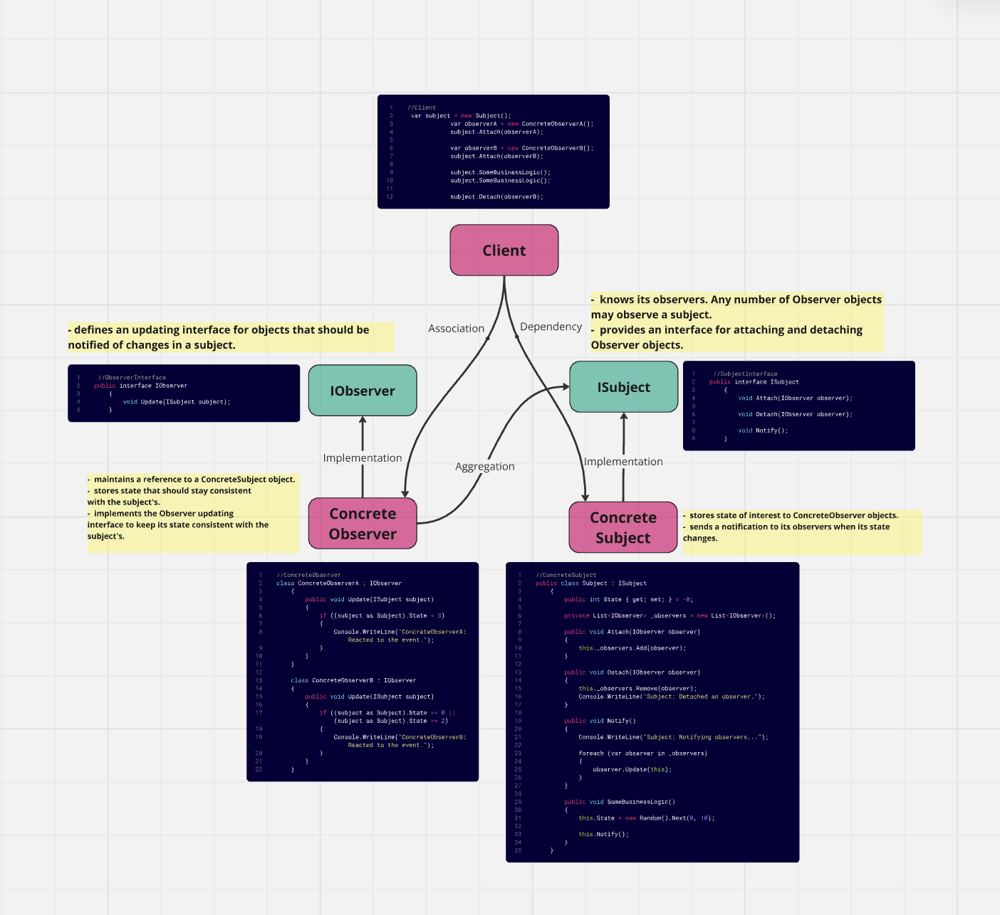

# Design Patterns in C#

## Overview

This repository contains implementations of **19 design patterns** categorized into **Creational**, **Structural**, and **Behavioral** patterns. The project serves as a learning resource to understand the practical use and structure of each design pattern as described in **“Design Patterns: Elements of Reusable Object-Oriented Software”** by Erich Gamma, Richard Helm, Ralph Johnson, and John Vlissides (Gang of Four). Additionally, it is inspired by explanations and examples from [Refactoring.Guru](https://refactoring.guru).

Each design pattern is structured with documentation, code implementation, and visual diagrams for better understanding.

## Repository Structure
```
DesignPatterns/
│
├── AbstractFactoryPattern/
├── AdapterPattern/
├── BridgePattern/
├── ChainOfResponsibilityPattern/
├── CommandPattern/
├── CompositePattern/
├── DecoratorPattern/
├── FacadePattern/
├── FactoryPattern/
├── IteratorPattern/
├── MediatorPattern/
├── MementoPattern/
├── ObserverPattern/
├── PrototypePattern/
├── ProxyPattern/
├── SingletonPattern/
├── StrategyPattern/
├── TemplateMethodPattern/
└── VisitorPattern/
```

Each folder contains:
- **Assets/**: Images such as diagrams and schematics explaining the pattern.
- **ExampleUsage/**: Contains example implementations to demonstrate the pattern in real-world scenarios.
- **Template/**: A basic template for implementing the design pattern.

- ## Example Diagram: Observer Pattern
Below is an example diagram showcasing the **Observer Pattern** and its implementation:



## Design Pattern Categories and Implementations

### **Creational Patterns**
Creational patterns deal with object creation mechanisms, trying to create objects in a manner suitable to the situation. These patterns provide a way to decouple a client from the objects it needs to instantiate.

1. **Abstract Factory**: Provides an interface for creating families of related or dependent objects without specifying their concrete classes.
2. **Factory Method**: Defines an interface for creating an object but lets subclasses alter the type of objects that will be created.
3. **Prototype**: Creates new objects by copying an existing object, ensuring performance and memory optimization.
4. **Singleton**: Restricts the instantiation of a class to a single instance and provides a global access point to it.

### **Structural Patterns**
Structural patterns deal with object composition, ensuring that if one part changes, the entire structure remains intact.

1. **Adapter**: Allows incompatible interfaces to work together by converting the interface of a class into another interface that clients expect.
2. **Bridge**: Decouples an abstraction from its implementation, allowing the two to evolve independently.
3. **Composite**: Composes objects into tree structures to represent part-whole hierarchies. This lets clients treat individual objects and compositions of objects uniformly.
4. **Decorator**: Adds new functionality to an object dynamically without altering its structure.
5. **Facade**: Provides a unified interface to a set of interfaces in a subsystem, simplifying the complexity of subsystem usage.
6. **Proxy**: Provides a placeholder for another object to control access to it.

### **Behavioral Patterns**
Behavioral patterns focus on communication between objects, making it easier to design complex systems.

1. **Chain of Responsibility**: Passes a request along a chain of handlers. Each handler either processes the request or passes it to the next handler.
2. **Command**: Encapsulates a request as an object, allowing parameterization of clients with queues, requests, and operations.
3. **Iterator**: Provides a way to access the elements of an aggregate object sequentially without exposing its underlying representation.
4. **Mediator**: Reduces coupling between components by having them communicate via a mediator.
5. **Memento**: Captures and externalizes an object’s internal state so that it can be restored later without violating encapsulation.
6. **Observer**: Defines a subscription mechanism to notify multiple objects about any events that happen to the object they’re observing.
7. **Strategy**: Defines a family of algorithms, encapsulates each one, and makes them interchangeable.
8. **Template Method**: Defines the skeleton of an algorithm in the superclass but lets subclasses override specific steps.
9. **Visitor**: Represents an operation to be performed on the elements of an object structure without changing the elements’ classes.

## Resources and References
1. **Design Patterns: Elements of Reusable Object-Oriented Software**  
   By Erich Gamma, Richard Helm, Ralph Johnson, and John Vlissides.  
2. **Refactoring Guru**  
   [https://refactoring.guru](https://refactoring.guru)
